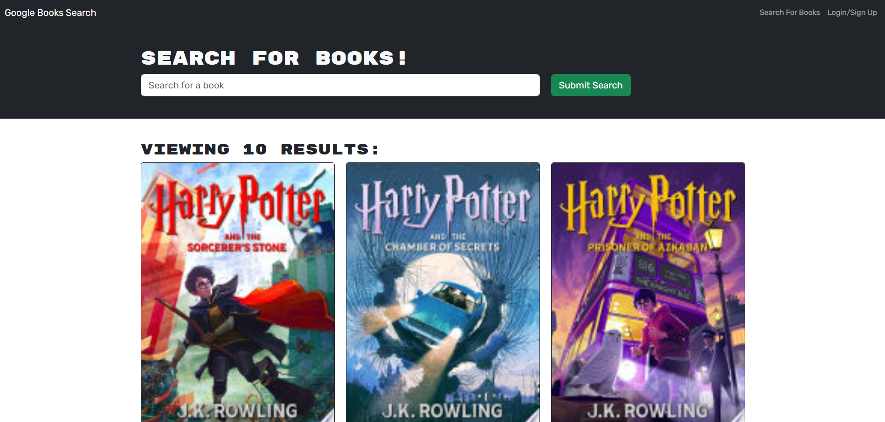
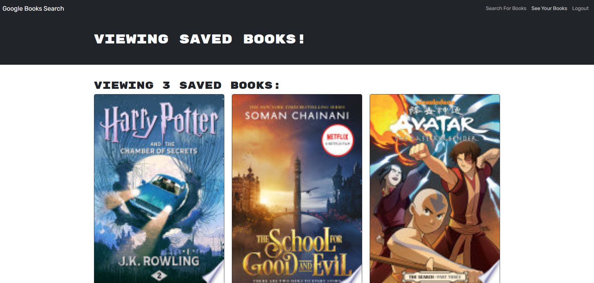

# Book-search-app
 
 

## Description  :bookmark_tabs:

I spent a lot of hours into developing the Book-search-app, aiming to create a seamless experience for users. While I managed to implement book search functionality successfully using the MERN stack, I couldn't pass the sign-in process. Despite my best efforts, I've been unable to resolve the error that occurs at sign-in and/or login. It's been frustrating, and despite days of troubleshooting, I still can't figure it out what the issue is. I'm uploading the project as is, but maybe after a while after the bootcamp I will check again on it and fix the bug.

## Installation :computer:
You can check the app by cloning the repository and runnin the next commands:

    npm i
    npm run develop
    
## Usage :bar_chart:
This is how the app should looks like:

----
----
----

---
    
As you can see, when you open the app you can check any book that you would like, and after login in you can save the books you want and go to the savedBooks page.

## License :memo:
---
---
MIT License

Copyright (c) 2023 Sergio S. Ardila-Alvarado

Permission is hereby granted, free of charge, to any person obtaining a copy
of this software and associated documentation files (the "Software"), to deal
in the Software without restriction, including without limitation the rights
to use, copy, modify, merge, publish, distribute, sublicense, and/or sell
copies of the Software, and to permit persons to whom the Software is
furnished to do so, subject to the following conditions:

The above copyright notice and this permission notice shall be included in all
copies or substantial portions of the Software.

THE SOFTWARE IS PROVIDED "AS IS", WITHOUT WARRANTY OF ANY KIND, EXPRESS OR
IMPLIED, INCLUDING BUT NOT LIMITED TO THE WARRANTIES OF MERCHANTABILITY,
FITNESS FOR A PARTICULAR PURPOSE AND NONINFRINGEMENT. IN NO EVENT SHALL THE
AUTHORS OR COPYRIGHT HOLDERS BE LIABLE FOR ANY CLAIM, DAMAGES OR OTHER
LIABILITY, WHETHER IN AN ACTION OF CONTRACT, TORT OR OTHERWISE, ARISING FROM,
OUT OF OR IN CONNECTION WITH THE SOFTWARE OR THE USE OR OTHER DEALINGS IN THE
SOFTWARE.

---
---

